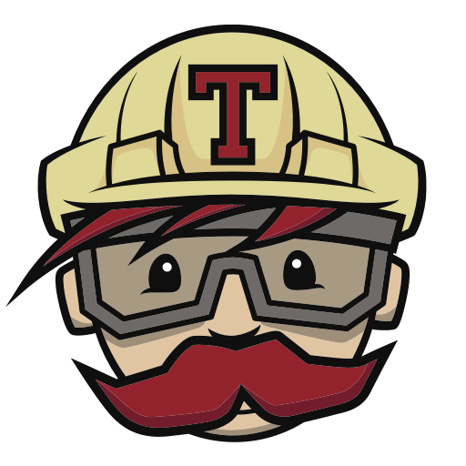
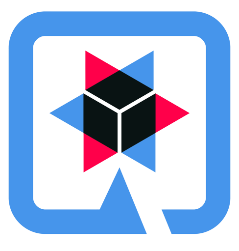

<a align="center" href="https://github.com/anuraghazra/convoychat">
 
<h2>Olá, sou Mário júnior</h2>
 

Sou facinado pelo desenvolvimento de sistemas em Java, JSP, JPA, Hibernate, MySQL
e Spring Framework são umas das gamas de funcionalidade que utilizo em seu desenvolvimento com algumas realização de dimensionamento de codificação de
aplicativos RESTful.

 <h3>🛠 Linguagens e Ferramentas</h3>

  
 
  <i class="devicon-html5-plain colored"></i>
   
  
  
  
  
  
  
  
  
  

   
  
  
  
  
   
  
  
  

 
  
 

  
 

  <a href="https://github.com/Mario23junior">
  

 

  </a>
